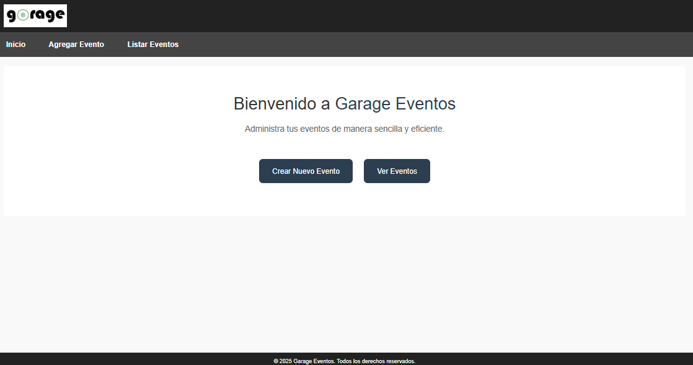
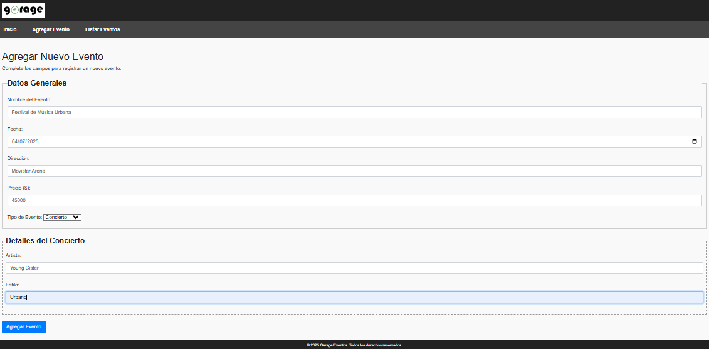
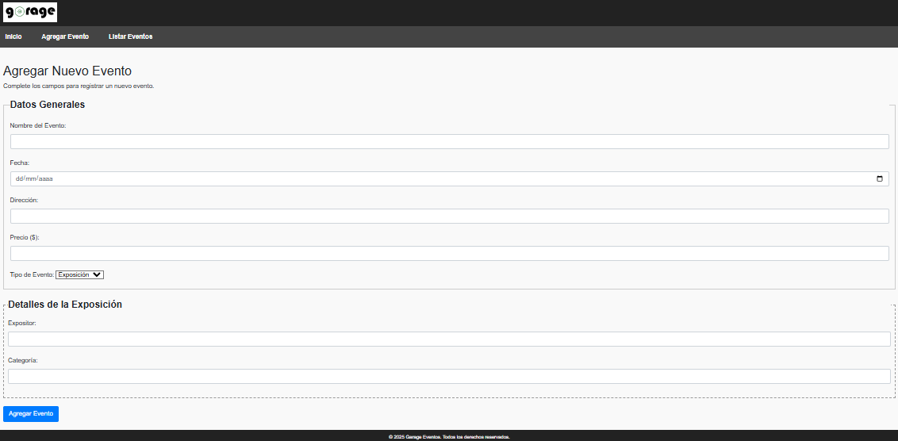
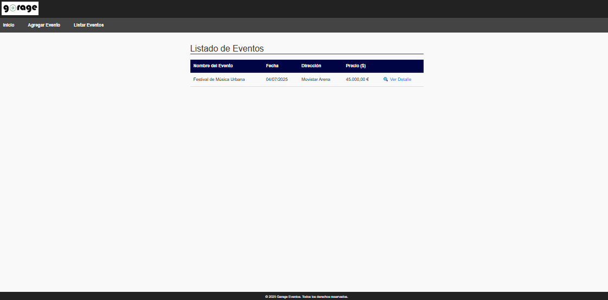
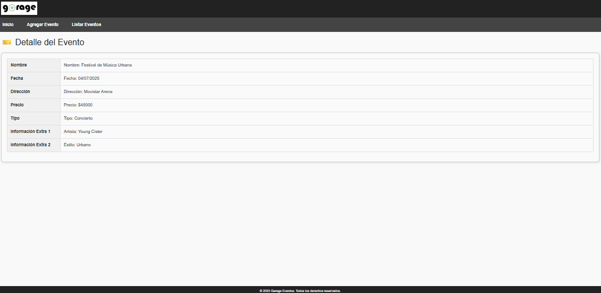

# garage_deploy_web
Sitio web ASP.NET Web Forms publicado desde Visual Studio para su despliegue en IIS sobre Windows Server. Proyecto de prueba con eventos como conciertos y exposiciones.

## Descripción
Este proyecto consiste en una aplicación web desarrollada con ASP.NET Web Forms en C#, enfocada en la gestión de eventos. Permite crear, visualizar y organizar eventos como conciertos y exposiciones a través de formularios web.

Fue diseñado con fines educativos para practicar el proceso completo de publicación y despliegue de una aplicación web en un entorno de servidor usando IIS (Internet Information Services) en Windows Server, dentro de una máquina virtual.

## Tecnologías utilizadas

- Visual Studio 2022 (C#)
- ASP.NET Web Forms (.NET Framework 4.8)
- HTML, CSS
- IIS 10 (Internet Information Services)
- Windows Server 2022 (VM)
- Git & GitHub

## Funcionalidades
- Formulario para crear eventos.
- Lista de eventos registrados.
- Detalles de conciertos y exposiciones.
- Publicación desde Visual Studio.
- Despliegue en IIS sobre máquina virtual.

## Capturas de pantalla
### Vista principal del sitio web

### Formulario para agregar un evento

### Listado de conciertos registrados

### Detalle de cada evento

## Cómo desplegar

1. Publicar el proyecto desde Visual Studio (Publicar > Carpeta).

2. Copiar la carpeta publicada a la máquina virtual (Windows Server).

3. Configurar IIS:

- Crear un nuevo sitio.
- Establecer ruta física al proyecto publicado.
- Asignar puerto (ej: 9090).

4. Iniciar el sitio y verificar en navegador.

## Autor
José Alejandro Contreras Castro

Estudiante de Ingeniería Informática

Proyecto con fines educativos
